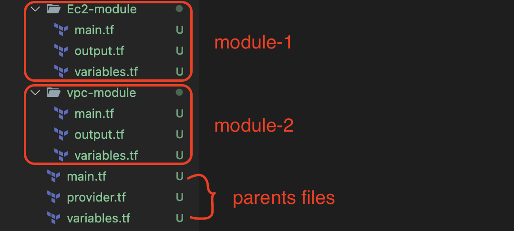

- Structuring the resource creation in certain folders where each folder can be used to group to create resources related to that group.
- Example 



- Find the modules from here https://registry.terraform.io/
- Syntax Format for module
- `module "module-name" {source = ""}`
### main.tf 
```
## VPC Module

module "vpc" {
  source  = "terraform-aws-modules/vpc/aws"
  version = "5.9.0"
}
```
- once we do `terraform init` it downloads the module and creates its own folder structure


- But, make sure to read the usage section to create the resource using the modules

- Here how we are using the VPC modules, and creating the VPC as resource

```
provider "aws" {
  region = "ap-south-1"
}

data "aws_availability_zone" "name" {
    state = "available"
}

module "vpc" {
  source  = "terraform-aws-modules/vpc/aws"
  version = "5.9.0"

  name = "my-vpc"
  cidr = "10.0.0.0/16"

  azs = data.aws_availability_zone.name.names
  public_subnets = [ "10.0.1.0/24" ]
  private_subnets = ["10.0.2.0/24"]
}
```
